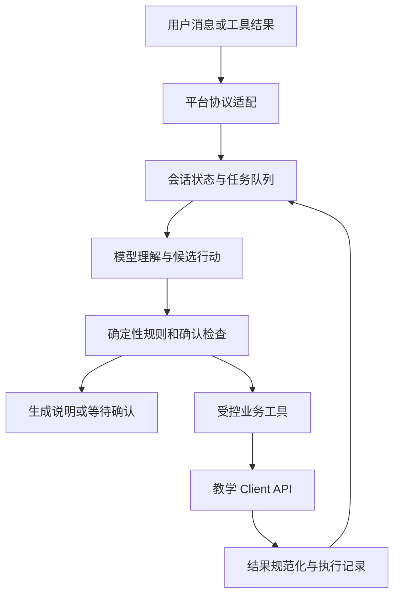
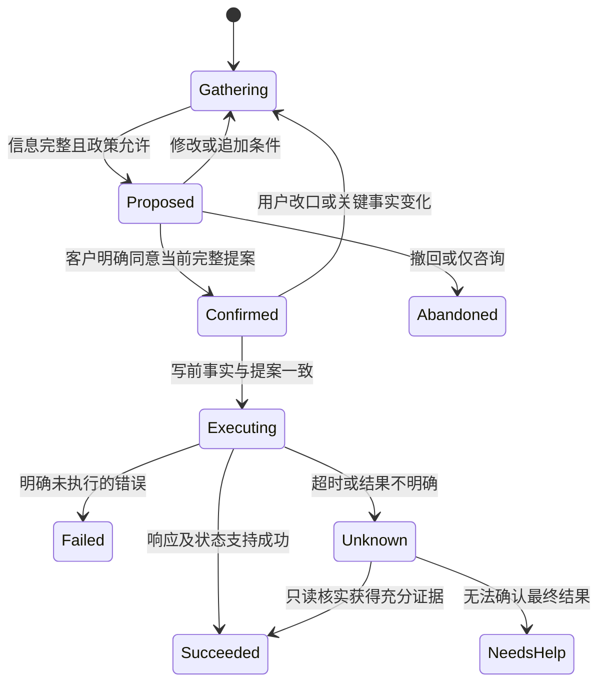

# Retail-Agent 项目实施计划

制定日期：2026-09-29。基线：`main`，`c37119df88759ca9434035166184cef80ea709c3`。

本文记录实施计划及本地进展。现有接入事实、已完成分析和未来工作分别标明；阶段勾选只代表对应范围的本地交付，不代表业务功能整体实现或获得远程评测授权。

2026-10-04 已按用户要求完成 [待核实事项全面复核](PENDING-ITEMS-AUDIT.md)。不再以退款结算公式、阅读/签名回执、平台 CAS 或未公开的完整容量数值作为整个项目的前置；按现有契约实施，真正未知的信息转为明确能力限制及异常策略。重分类不等于代码修复、测试通过或里程碑完成。

此前 M0 提交及补充文档 40f6ae0 已推送到 main。M1 源码/测试按公共传输、协议/状态/入口、金额兼容三批独立提交推送（4e5728f、62eb206、ba53f46），各自 t1 1/1 通过，交付收尾为 0886ab2，详见 [M1 交付记录](M1-DELIVERY.md)。2026-10-02 用户随后明确开始 M2，本轮已实现身份与只读服务、真实 SDK＋fake 网关离线往返；完整源码提交快照 91/91 通过；2026-10-03 已分三批提交推送，各自 t1 1/1 通过，真实模型未启用，详见 [M2 交付记录](M2-DELIVERY.md)。公开契约与风险见 [平台契约核查记录](PLATFORM-CONTRACT-NOTES.md)。

## 1. 项目判断与实施目标

<!-- CURRENT-EVIDENCE:LINK -->
当前运行、计数和证据范围统一见 [当前证据](CURRENT-EVIDENCE.md)；本文件的里程碑记录保留对应历史范围。

以下为 2026-10-03 的历史阶段记录，段内完成状态仅指当时快照，不覆盖顶部当前状态。用户明确开始 M3；M3.1 规则批次回归为 130/130，源码 cd71a21、文档 9b323d3 已推送。M3.2 离线回归 176/176，源码 610f488、文档 769bcee 已推送，工作流成功、报告正文计数未单独核实，见 [M3.2 交付记录](M3.2-DELIVERY.md)。随后按用户授权完成 M3.3 内部完整操作集合的局部确认、追加/撤回/条件与失效，该批源码实跑 221/221、零跳过、原生退出码 0；源码 abac040 已推送，自动工作流成功，报告正文计数未单独核实，见 [M3.3 交付记录](M3.3-DELIVERY.md)。默认只读路由不自动生成业务提案；业务写流程未启用。退款合计依据和完整履约冲突控制仍保留，M3.1 与 M3 整体不勾选。

2026-10-03 随后按用户授权实施 M3.4 内部请求依赖图、同单冲突和逐记录候选诊断，源码提交后实跑 266/266、零跳过、原生退出码 0，schema 4，见 [M3.4 交付记录](M3.4-DELIVERY.md)。测试环境 53ee070、源码 2413049 已逐批推送；对应同一 t1 工作流成功，报告正文案例计数未单独核实，见交付记录。该批交付时 M3.5、业务结果 reducer 与实际依赖释放保留；后续 M3.5 通用离线实现见下文。

项目可以进入实施阶段。代码、教学接口、业务材料和公开案例已足够支撑架构设计与离线开发。现状是一个通过 t1 的客户身份查询模板，距离完整零售客服 Agent，主要缺口是多轮任务管理、确认控制、订单规则、业务工具、模型适配和完整对话测试。

建议采用“模型理解自然语言与组织回复，确定性代码校验规则和控制执行”的方案。先形成一个从身份验证、读取订单、提出变更、等待确认到写入并核实结果的完整流程，再扩展其他业务。仅堆叠工具或把全部政策放进提示词，无法可靠处理客户改口、订单状态变化及一次性操作。

目标能力：

- 在同一会话中验证并服务一个客户，支持该客户多个订单和多个请求。
- 查询订单、商品规格、库存、价格、支付与履约事实，并解释支持范围。
- 按政策更新默认地址、订单地址、支付方式，办理取消、待处理商品修改、退货和换货。
- 在执行前获得与具体变更一致的确认；用户改口、报价变化或状态变化后使旧确认失效。
- 对不支持、越权、不可确认或结果不确定的请求给出真实说明，按需要转人工。
- 所有业务结论由 API 事实和规则得出，不按公开案例 ID、客户固定数据或答案表分支。

本计划覆盖完整业务能力的开发准备，不改变当前 `t1` 绑定，也不授权运行全部公开案例。项目没有建设独立网站、数据库、支付系统或生产客服部署的需求；这些不纳入本轮实施。

配套文档：

- [业务规则与证据台账](POLICY-REGISTER.md)：规则、生效依据、过时方案和待核实边界。
- [案例覆盖与验收矩阵](CASE-COVERAGE.md)：134 项公开案例的分类、代表案例和测试批次。
- [接口契约基线](API-CONTRACT-MAP.md)、[全案例来源索引](CASE-TRACE.md)及[高风险决策审查](CASE-DECISION-REVIEWS.md)：M0 当前产物与未完成边界。
- [待决事项寄存器](OPEN-ITEMS.md)、[M0 交付记录](M0-DELIVERY.md)与[M1 交付记录](M1-DELIVERY.md)：问题状态、分阶段提交与验证证据及下一阶段入口条件。

## 2. 已核实的基线

| 方面 | 当前事实 | 实施含义 |
|---|---|---|
| 项目位置 | `E:\Retail-Agent` | 代码、开发测试及派生项目文档放在这里 |
| 原始材料 | `E:\enterprise-ai-materials\retail_plus`；解压资料在 `extracted\materials` | 保持仓库外；运行时不读取本机这个路径 |
| 凭证 | `E:\Enterprise-AI.json` | 保持仓库外；本计划不读取内容，不复制到代码或文档 |
| 绑定 | `5147314e-f2da-4bac-924a-e2ad95e647e4` | 不替换、不重新绑定 |
| 仓库/分支 | `1471436961/retail-agent` / `main` | 不擅自改评测分支 |
| 场景/语言/任务 | `retail_plus` / Python / `t1`；用户给定 `case_ids: null` | 不把 null 理解为运行全部 134 个案例 |
| 入口 | `agent/agent.py`、`agent/tools.py`、`agent/agent.json` | 保留平台工厂及工具发现方式 |
| 已实现功能 | 一个 `lookup_customer` 工具，先邮箱搜索再读档案 | 使用了 14 个 REST 操作中的 2 个，尚无业务写能力 |
| 状态管理 | 制订时只有 `turn`、`pending_call_id`、`customer_id` 且初始化忽略历史；M1 已增加 JSON 状态和已知查询历史恢复 | M2 起还需把任务、提案、确认和写结果接入实际工作流 |
| 模型 | M1 已保留 context，尚不调用模型；generate 签名与消息/工具/用量已有公开证据 | 按已知契约设计接口和 fake，薄适配层验证真实 SDK 与异常 |
| 本地测试 | 制订计划时 6/6；2026-09-30 为 25/25；2026-10-01 评审修复后 37/37 通过 | 当前覆盖基础查询、协议、恢复、接口分类和离线适配；不代表业务评测通过 |
| 既有远程报告 | t1，`integration-check`，1/1 passed | 身份验证先于档案读取已通过；不是 p1/t2 业务成绩 |

既有报告：[GitHub Actions](https://github.com/1471436961/retail-agent/actions/runs/36437403776)、[Agentist 结果](https://agentist.org/lab/enterprise-ai?run=4df4483b-8eb7-4614-b0fd-4e79f069080d)。本次只是核对已下载报告，没有提交新评测。报告记录上述 commit；平台同时以上传代码快照哈希标识实际提交内容，不将其表述为平台独立拉取并验证了仓库提交。

分析材料包括：工程源码和测试、框架契约、教学 OpenAPI、134 项公开案例、身份 intake、历史案例、14 封邮件、5 份会议记录、Slack 导出、嵌套接口/系统导出、5 张流程图和 25 页培训 PDF。截图已建立 60 张的索引并重点核对业务帮助页；截图索引不等于所有像素均已逐字核验。历史案例是政策证据，不等同于公开评测 ID。

## 3. 规则与接口的使用原则

### 3.1 区分三类权威

1. **实际调用方式**：按教学 OpenAPI、框架契约、CLASSROOM 及 [当前平台核查记录](PLATFORM-CONTRACT-NOTES.md)中的 path/version。课堂覆盖上游不适用的运行方式，当前平台澄清补充本地快照；不声称同名文件版本相同。
2. **业务允许做什么**：按生效范围、正式状态和日期裁决读取业务证据。正式决定优于提案；只在同一业务范围内比较版本，不能简单选文件名含 final 或日期最大的文件。
3. **需要覆盖哪些需求**：公开案例提供客户需求及预期，必须连同“业务要求”阅读；它们不是可硬编码的答案，也不是后台规则的替代品。

参考手册材料只提供了部分信息，不能声称掌握未提供的完整手册。遇到现有证据无法消除的冲突，写入问题台账，先完成不依赖该争议的工作，在相关写操作启用前解决。

### 3.2 必须固化为代码与测试的规则

| 规则组 | 实施要求 |
|---|---|
| 身份与归属 | 邮箱或完整姓名＋邮编独立搜索；客户 ID、订单号、档案内读出的邮箱不能替代验证。验证后限定本客户，订单详情仍核对 owner |
| 查询与授权 | 询问、讨论方案、表达偏好不是写入许可；只读查找不要求业务变更确认 |
| 公共目录 | 验证后可为当前请求查公共商品目录、统计和比较，不限历史订单商品；不访问他人账户或创建购物订单 |
| 完整确认 | 各类记录变更均须说明目标记录和相关变更；订单、商品、金额、支付方式在相关时必须明确。地址修正后重新完整复述 |
| 单次商品修改 | 待处理订单整单收齐商品替换，一次提交；确认完整清单、询问是否还有其他修改，并等待回复。提交后进入 `pending (items modified)`，不能继续改地址、支付或取消 |
| 取消 | 仅接受 `no longer needed`、`ordered by mistake` 及语义明确的自然表达；价格投诉等不能强行归类。先获得原因，再复述订单、金额、退款去向并确认 |
| 退款 | 取消、退货、换货、商品修改和支付切换分别建规则。不得复用一个无差别的“退款到任意卡”函数 |
| 商品 | 区分 product 与 item；同产品可用规格替换；未要求修改的属性保持。保留重复商品的次数，不能用集合悄悄去重 |
| 金额 | 保留订单成交价、目标价与顺序；修改/换货按 float 累加后 round(total, 2)，以回执核实，不逐行舍入或改用 ROUND_HALF_UP。付款/退款分开，申请或取消不等于到账 |
| 状态 | 每个新操作和写前检查真实状态；用户说已收到，不替代后台 delivered。保留原始状态枚举 |
| 能力边界 | 不改数量、不拆单、不改邮箱、不添加支付方式、不下新订单、不恢复已取消订单；网页具有某功能不代表 Agent 获得其 API 权限 |
| 不确定结果 | 所有写操作及转人工禁止自动重试；查询核实不能证明结果时，保留不确定状态并停止依赖动作 |
| 转人工 | 使用可信 `client_api.context.conversation_id`；受理后结束业务工具流；按适用要求输出规定提示 |

### 3.3 订单状态与写操作基线

| API 状态 | 允许的订单写操作 | 主要处理方式 |
|---|---|---|
| `pending` | 地址、支付、取消、同产品规格修改；仍需各自前提 | 写前检查；若履约事实与未发货假设冲突，先停止该写入并核实 |
| `processed` | 无 | 说明当前限制；送达后可按政策退换，客户坚持时按流程转人工 |
| `delivered` | 开启退货或换货 | 同单两类请求冲突时先明确最终选择，不先执行其中一半 |
| `pending (items modified)` | 无进一步订单修改/取消 | 保留本次已完成结果，拒绝第二次追加或伪装为普通 pending |
| `cancelled` | 无 | 可解释已记录结果，不恢复、不再次取消 |
| `return requested` | 不追加新的退换申请 | 查询并说明已提交范围，不声称已经退款到账 |
| `exchange requested` | 不追加新的退换申请 | 查询并说明已提交范围、差价及支付方式 |

默认地址属于客户档案，不等于订单地址。修改其一不能顺带更改另一项；客户同时要求两者时分别列入提案和执行结果。

## 4. 目标架构

### 4.1 执行路径



模型输出只是候选行动。实际发出工具调用前，应用层审核身份、订单归属、动作类型、完整参数和确认快照。工具层再根据自身可重放的会话记录和最新后端事实核对权限、状态和参数。

工具层与应用层不能依赖未记录的共享全局内存。模型参数中的 `confirmed: true` 不构成用户确认。工具重放能证明已记录调用的可重复执行行为，不能独立证明用户说过什么；这项证据由应用层保留真实消息关联，并以对话轨迹测试验证。

### 4.2 模块职责与预期目录

以下树列出 M2–M5.4 已有模块；“待 M4/M5”仅表示后续方向，不要求创建空壳文件。只读 API/工具/流程统一由 read_api/read_tools/read_session 承担，不再另建重复只读实现。地址、支付与取消流程复用同一身份、任务、提案和写 journal，不复制验证与归属门控。

```text
E:\Retail-Agent\agent\
  agent.py                          工厂入口、获取并保留平台 context
  tools.py                          工具发现入口
  agent.json                        现有协议、语言和领域声明
  support_agent\
    application.py                  轮次控制与模型建议审核
    turns.py                        不依赖 tau2 的轮次薄入口
    read_session.py                 身份范围、只读路由、批次登记/消费
    amount_summary.py               M6.2 默认只读跨单金额来源与分类合计
    address_session.py              M4.1 地址 producer、内部调度和完整结果接纳
    payment_session.py              M4.2 支付 producer、选择/复述及提交
    cancellation_session.py         M4.3 原因/逐 charge 复述、确认与提交
    returns_session.py              M5.3 完整退货/起点来源/预计额/确认申请
    items_session.py                M5.2/M5.4 共用完整替换生产器/来源/确认提交
    exchange_session.py             M5.4 delivered 完整换货薄入口/有符号差价
    handoff_session.py              M4.4 显式请求、证据摘要及终态转接
    workflow_boundary.py            六类工作流共享批次、诊断、预算与恢复
    workflow_registry.py            有序业务 kind 清单，工具名与通用守卫共用；转接独立
    workflow_limits.py              地址/支付/取消/商品/退货/换货共用内部工具 UTF-8 参数/结果预算
    state.py                        JSON 会话状态及恢复
    proposals.py                    已实现 M3.2/M3.3 完整提案、范围确认与原消息来源恢复
    candidate_session.py            M5.1 真实 user/完整目录证据的内部候选入口
    tasks.py                        已实现 M3.4 内部计划、来源恢复及逐记录候选诊断
    write_session.py                M3.5 通用刷新/单次发送/journal；显式串行会话端口可注入
    model_context.py                有界模型投影与派生数据摘要；完整授权证据留在 state
    protocol.py                     内部消息、行动、结果类型
    adapters\
      model_gateway.py              已实现，真实 SDK＋fake 离线验证；真实联调保留
      client_api.py                 传输、路径编码、响应与错误规范化
      customer_api.py                t1 接口兼容；验证委托 read_api
      customer_tools.py              t1 工具入口，继承 ReadTools/AddressTools/PaymentTools/CancellationTools/HandoffTools/ItemsTools/ReturnsTools/ExchangeTools
      read_api.py                    六只读端点、验证/归属/响应校验
      read_tools.py                  带独立验证依据的可重放只读工具
      address_tools.py               M4.1 内部地址 WRITE；可信 API 与共享认领表
      payment_tools.py               M4.2 内部支付 WRITE；复用同一 API/认领表
      cancellation_tools.py          M4.3 内部取消 WRITE；复用原会话/journal
      returns_tools.py               M5.3 内部退货申请 WRITE；模型不可派发
      exchange_tools.py              M5.4 内部完整换货 WRITE；复用真实 SDK/认领表
      items_tools.py                 M5.2 内部完整商品 WRITE；模型不可派发
      handoff_tools.py               M4.4 内部转接 WRITE；可信会话/证据摘要
      write_runtime.py               显式串行会话端点适配/稳定认领；默认工厂不注入
      business_tools.py              写工具声明（待 M3/M4/M5）
    domain\
      identity.py                    验证与归属
      addresses.py                   M4.1 有限中英文字段/目标/地址复制解析
      payment_intake.py              M4.2 已有方式/明确回退/唯一整单 charge 解析
      cancellation_intake.py         M4.3 真实 user 原因/目标及逐 charge 显示
      rules.py                       可解释 JSON 规则结果，非写入授权
      orders.py                      精确状态及一次性操作准入规则
      catalog.py                     选中规格/次数/价格解析，完整清单校验
      returns_intake.py              M5.3 真实 user 原商品次数/合法去向有限解析
      items_intake.py                M5.2/M5.4 原 user 条件/完整列表/方式有限解析
      candidate_selection.py         M5.1 纯候选筛选、显式偏好/回退与排序
      money.py                       已公开 float/round 算法的兼容估算
      policies.py                    支付资格/渠道时效与取消原因已接生产器
      task_graph.py                  M3.4 纯函数同单依赖、对称冲突和独立记录图
      write_receipts.py              M3.5 履约审查、回执及强读回效果；不证明到账
    workflows\
      # 待处理写流程复用包根 address/payment/cancellation/items_session.py，不另建 pending_order.py
      # 退货复用包根 returns_session.py；换货 exchange_session.py 复用 items_session.py
      # 人工转接复用包根 handoff_session.py，不另建 handoff.py
    policies\                       生效规则与编号（待按需整理）
    prompts\                        提示词目录（待按需拆分，当前 READ_POLICY 内置）
E:\Retail-Agent\tests\              纯规则、适配器、状态化对话和重放测试
E:\Retail-Agent\docs\               规则、追踪矩阵、决策记录及验收报告
```

继续使用标准库优先的轻量实现；本地 `tau2` 不可用时，将核心轮次决策与平台类型分开。不要引入大型 Agent 框架、向量数据库或自建持久化服务作为默认前提。原始材料先整理成精简、可追溯规则，运行时无需对整包邮件和截图做检索。

### 4.3 会话状态

下表是完整业务 Agent 的**目标结构**。M2 已增加身份来源、档案与只读批次；M3.2/M3.3 的 proposals 已保存完整语义、范围版本、事实快照、原消息索引及可核验的旧确认保留来源。M3.4 将 state schema 升至 4，tasks 保存当前结构化请求及来源、依赖和冲突；诊断按已有规则/确认动态计算，不存模型自报进度。独立 facts 缓存尚不存在，pending_calls 继续支持至多 8 个只读描述。计划/提案通过内部入口展示，真实用户轮次处理整份/局部确认、撤回与改口；默认只读路由不自动生成业务任务或提案。完整报价、业务完成/Unknown 结果 reducer、依赖完成后的释放与实际写执行仍待后续阶段。

| 状态项 | 内容与约束 |
|---|---|
| `schema_version` / `turn` | 允许明确升级状态结构；调用 ID 用确定性会话序号生成 |
| `identity` | 验证状态、已验证 customer_id、验证方式和来源消息；未验证的用户声明单独保存 |
| `history` | 规范化消息和关键事实；恢复时不重新发出已执行写操作；摘要保留所有未完成提案与确认关系 |
| `tasks` | 每个客户请求的目标、订单、约束、依赖和进度；不把所有订单合成一个状态 |
| `facts` | 后台返回的订单、商品及支付事实与获取序号；确认后、写前按需刷新 |
| `proposals` | 动作、目标、完整商品多重列表、地址、支付/退款方式、金额、版本及关联消息 |
| `pending_calls` | call_id → 动作、任务、目标、预期结果；支持缺失、重复、乱序结果处理 |
| `operations` | 未执行、执行中、成功、明确失败、结果不确定；保存已消费工具结果和真实回执 |
| `handoff` | 未请求、请求中、已受理、结果不确定；已受理后禁止继续业务调用 |

本项目选择 JSON-only state 作为可恢复、可验证的工程约束；平台公开契约定义的是不透明状态对象。SDK、网关和 Decimal 实例不直接塞入本项目 state，网关保留在 Agent 实例中，客户状态不放模块全局。保留原始金额精度和请求顺序，state 可保存有限 JSON 数值或规范化数字字符串；Decimal/整数分适合部分表示与比较，不能提前截掉精度或未经验证替代后端 float 累加/round 算法。

当前平台 `message_history` 是 `get_init_state()` 的恢复输入，state dict 在普通轮次间直接传递。M2 按消息顺序恢复，仅此前用户输入可授权历史调用；保留调用参数、已接纳结果与批次边界，错误/错配/未接纳批次只存受控状态，不存原正文。恢复不调用 API、不重发工具，模型输入也复核旧 JSON 历史。旧版精简历史缺失事实不能补造；未来写流程仍另验收。Q2 摘要须保护原始用户验证输入、验证调用及已接纳档案的完整来源链，不能以助手摘要代替；设计与迁移门槛见 [Q2 身份证据保留设计](STATE-EVIDENCE-RETENTION.md)。

### 4.4 确认与执行状态机



提案版本必须覆盖语义内容，不能只标记“该订单已经确认”。客户只确认其中一项时，仅该项可获授权；“可以，不过把蓝色改为黑色”属于新提案。明确确认仍有效且事实未变时不反复索取同一确认。

M3.2 当前完整提案已绑定已接纳客户/订单及修改、换货的目标目录价格/可用性/属性和读取来源。check_confirmation 返回带 code 的匹配结果，布尔包装遇坏状态返回 False；平台入口对损坏证据保存终止型隔离包装，持续阻断，不自动重置身份或重放调用。ACK 的版本/原确认引用独立于措辞；同额 int/float 不造新版本，金额算法不变。真实 v1 固定 fixture 可迁移，缺必需键仍拒绝。展示记录不等于传输送达，显式 SDK 入口已核实消息/state 一起返回，未来业务调用方须复用；该风险及历史×版本的回放成本见 [实施事项](OPEN-ITEMS.md)。写前刷新已在 M3.5 内部完成，完整业务报价生产器仍待 M4/M5；范围语义现由下述 M3.3 新入口提供。

同单地址、支付和商品修改的组合需要先确定客户最终意图、分别说明影响，通常先完成地址/支付再执行会锁定订单的商品修改。若同时存在取消请求，先澄清最终选择；不能用固定排序替代客户意图。跨单操作分别记录结果，不假设存在跨订单事务，也不自动回滚已经成功的业务操作。

M3.3 新 present_proposals 入口将同轮完整操作分别编号，真实 user 可局部确认、撤回或指出改变；一个商品清单仍是一项完整操作，部分商品/追加需重算和复述。条件子句不被直接执行，核实选定方案后须重新完整提案。未改变且事实相同的独立原确认可由可重放的 reuse_version 来源链保留，不重复索取；紧接本次集合复述的回复明确 only 排除其他范围时，即使已有保留确认也清除；早前排除结果随原历史重放，不被忽略或当作对未来新提案永久生效的过滤器。原 present_proposal 保留旧完整确认语义，生产器需要范围语义时使用新入口。两者使用同一台账和门控；没有任务调度器或写入能力，详见 M3.3 交付记录。

### 4.5 内部任务请求图

M3.4 新增 plan_tasks / inspect_task_plan，按同单锁单依赖和互斥操作生成任务图，逐记录给出前置核实候选；原批 schema 4 且无业务流程调用者。当前 schema 11，地址/支付/取消/商品/退货生产器调用同一 present_task_plan 并由通用写前门消费诊断，其他业务生产器未实施。只持有一份可用提案集合；新展示遗漏的旧操作跨订单也会失效，重新纳入未变化项可保留原确认，不等于独立多展示上下文。已有未完成混合计划不得被地址或支付任务静默覆盖；已核实写完成须由原 task_completed 判定。M3.5 的发送/结果 journal 继续区分确认与完成；M4.1 接入两类地址的独立回执和强读回，不推断跨记录事务。历史范围见 [M3.4 交付](M3.4-DELIVERY.md)，当前商品调用方见 [M5.2 交付](M5.2-DELIVERY.md)。

## 5. API 覆盖与工具设计

完整目录来自 [教学 OpenAPI](../materials/client_api/openapi.yaml)。共 14 个操作：6 个只读（包括 POST search）、8 个更改状态。下表按 HTTP 操作计数，Agent 工具可组合多个操作。

| # | 操作 | 用途 | 首次交付 |
|---|---|---|---|
| 1 | `POST /v1/customers/search` | 邮箱或完整姓名＋邮编验证 | M2 |
| 2 | `GET /v1/customers/{customer_id}` | 已验证客户档案、支付方式、订单引用 | M2 |
| 3 | `PUT /v1/customers/{customer_id}/default-shipping-address` | 默认地址完整更新 | M4 |
| 4 | `GET /v1/catalog/products` | 获得产品目录，按信息权限和业务相关性使用 | M2 |
| 5 | `GET /v1/catalog/products/{product_id}` | 同一产品规格目录 | M2 |
| 6 | `GET /v1/catalog/items/{item_id}` | 精确规格、库存、价格 | M2 |
| 7 | `GET /v1/orders/{order_id}` | 归属、状态、成交商品、交易与履约 | M2 |
| 8 | `PUT /v1/orders/{order_id}/shipping-address` | 订单地址完整更新 | M4 |
| 9 | `PUT /v1/orders/{order_id}/payment-method` | 更换一个已有支付方式 | M4 |
| 10 | `POST /v1/orders/{order_id}/cancellations` | 已确认原因的取消 | M4 |
| 11 | `POST /v1/orders/{order_id}/item-modifications` | 完整规格替换列表与差价方式 | M5 |
| 12 | `POST /v1/orders/{order_id}/returns` | 完整 item_ids 与退款方式 | M5 |
| 13 | `POST /v1/orders/{order_id}/exchanges` | 完整替换列表与差价方式 | M5 |
| 14 | `POST /v1/conversations/{conversation_id}/transfers` | 问题摘要与受控转接 | M4 |

实现要求：

- 工具只公开已知业务动作，禁止开放任意 URL、HTTP 方法或任意 JSON 透传工具。
- 地址按教学 `Address` 结构发送；不得把材料中的姓名、备注等未经支持字段加入请求。`address_line_2` 的空串、缺失和 null 依契约处理。
- 替换使用 `existing_item_id`、`replacement_item_id`；数量和重复行的映射须测试，不能凭空增加后端 line_id 参数。
- 所有路径标识符 URL 编码，保留 `#W...` 原始值；订单猜测需经自有订单列表验证，不任意纠正或试探他人订单。
- 响应先检查状态码和结构，再形成领域结果。使用实际 `customer_id`、`payments`、`return_request`、`exchange` 等教学字段，不能直接套用历史导出的字段名。
- 区分 400、404、409、422、413、502 和传输异常；业务拒绝要回到澄清/解释，不能统一伪装成“找不到”。
- 读取允许有界重试；所有写入和转接均禁止自动重试，包括看似幂等的 PUT。
- 成功写入具有强一致性，可读取核实；未知结果只能查已有端点，不编造任务轮询或幂等接口。
- 分页为 none，不追加自定义分页参数；请求/响应超限不通过拆分一次性业务写操作绕过。
- 付款、退款、库存变动由业务端点处理；不在 Agent 自建支付账本或向不存在的退款接口写入。

## 6. 模型接入与运行约束

### 6.1 接口职责与联调

工具名称、参数、说明和返回结构由本项目通过工具声明设计；内部候选动作、任务、提案、确认和提示词同样由本项目实现。平台规定工厂、轮次消息与注入能力，并调用我们的实现，不会替 Agent 补齐模型调用或业务逻辑。工厂可通过 `get_agent_context()` 获取 `action_interface`、`resources`、`model_gateway`、`runtime_config`；需要后续推理时保留网关对象。

先定义内部模型适配接口和结构化候选，使用 fake 完成业务与失败路径。已公开 `generate(*, model: str, messages: list, actions=None, tool_choice=None, call_name=None, **kwargs)`；Python messages/actions 是 tau2 消息/Tool 对象，正常返回 AssistantMessage。TypeScript 对照已取得，使用 tools schemas。薄适配层恢复 JSON 历史为 SDK 消息，保留多调用与 ID/批次，核验输出后才放行；内部候选不是网关原始响应。真实 SDK、可选参数完整语义及异常类型仍需验证，见 U1/Q3。

运行时 available_models 是本次允许列表；manifest 的 enterprise-haiku/max_tokens=1024 是配置快照，可用于合成测试，后续配置可能不同。固定参数应省略并由网关注入，不得覆盖或改小；one_of 每次必选。usage 缺失不算零，cost 为 0 不代表免费，credit_usage 依赖 rate card。预算段与 0.32 credits 不是模型/费用授权或美元额度，课堂未注入上游 credit rate card。真实调用需实际配置和费用授权；旧 t1 不证明当前代码或模型路径，当前资料也未证明与历史环境版本相同。

### 6.2 运行边界

- 仅 `agent/` 会被上传：最多 128 个文件，单文件 256 KiB，总计 2 MiB。
- 远程不安装依赖、不运行构建脚本；不上传虚拟环境、原始 ZIP、测试数据或整个业务材料库。
- 运行时不得依赖 `E:` 盘、repo 根目录文档或开发缓存。必要的规则摘要和提示词随 `agent/` 打包。
- 使用平台注入 Client API 与模型网关，不带用户凭证、外部模型 SDK 或自行联网请求。
- `AssistantMessage` 只能包含文本或工具调用之一；禁止在同条消息里询问确认并执行写入。
- 不以当前墙上时间、随机数或会话外状态决定工具业务行为。相同历史调用在新工具实例和新后端上必须可以确定性重放。

### 6.3 成本与性能

以实测决定优化，不编造单次费用或轮次 SLA。记录可获得的模型调用次数、token/credits、工具调用数和总轮次，不记录凭证。优先减少重复身份验证、重复读同一目录和把整段原始材料送入模型。

设定有界模型循环与错误修复次数；非法动作或结构解析失败只允许受控修复，绝不因此跳过确认。先保证规则正确，再评估精简上下文、目录缓存和独立读取并行；写操作保持明确串行与依赖关系。

## 7. 分阶段实施清单

状态：下列勾选状态更新于 **2026-10-04**，代表所列本地阶段产物；M0/M2/M3 的 SDK/内部勾选不代表真实模型、完整业务或远程评测通过，范围见 [当前收尾](M0-M3-CLOSEOUT.md)。工作量使用小/中/大相对等级，不承诺未经测量的日历工期。

业务实施顺序：`M2 → M3 → M4 → M5 → M6 → M7`，以 M0 已明确的规则/接口和 M1 离线底座为基础。M0.2 剩余需求追踪可随相关业务补齐；M0.4 的网关联调不阻塞 M2 内部模型接口、领域规则或工作流开发。真实模型调用前必须完成平台绑定验证并取得费用授权；完整追踪仍是最终验收门槛。

### M0：冻结规则与契约基线（优先级 P0，工作量中）

- [x] M0.1 将本计划的规则初稿扩为逐条可引用台账：规则编号、范围、生效状态、日期、来源位置、被替代版本、正/反测试。
- [ ] M0.2 全量需求分析与追踪基础设施完成：134/134、522 AT、全部 N/E/B 来源，现有实际组件方法/结果及待业务执行状态均入 [AT-TEST-TRACE](AT-TEST-TRACE.json)。完整本地业务验收由新增 M6.7 承接全部原子要求，逐条关联实际场景、直接断言和运行结果；当前关联组件／首批合成对话不等于完整业务执行，因此不整体勾选。M7 正式课堂评分单列，不是本地验收的授权前置。
- [x] M0.3 建立教学与历史字段映射，记录响应变体和数据规范化方式；提取 14 个端点的输入、输出、错误与重复调用约束。
- [x] M0.4 受支持的公开契约/固定 SDK 最小集成完成：真实工厂、轮次、消息/Tool、只读回归、提案及显式会话端口的 SDK 文本/state 往返通过。勾选限本地接口集成；课堂镜像对应和真实模型效果未实测，归 M7 授权运行，不作为开发前置，详见 [当前收尾](M0-M3-CLOSEOUT.md)。
- [x] M0.5 将第 9 节 U1–U7 区分为材料已明确的实施基线、窄联调边界与费用授权；未解决项限定具体分支和证据需求。

**产物**：更新的规则/案例台账、接口映射、运行时契约说明、待决问题清单。

**验收**：每项关键禁止行为有来源和负例；134 个 ID 无遗漏但不声称全部已测试；历史/教学字段不混用；模型未知项有明确验证方式。

### M1：协议、状态与离线测试底座（P0，中）

- [x] M1.1 保持入口兼容，抽取不依赖 tau2 的内部消息/动作类型与轮次决策。
- [x] M1.2 实现可序列化状态、会话隔离、pending_calls 和历史恢复，明确恢复时不重复写。
- [x] M1.3 建立状态化 fake API、脚本式 fake gateway、合成客户/订单/商品数据；保留现有 6 个回归测试。
- [x] M1.4 实现公共响应与错误分类、未知工具拒绝、schema 校验和离线候选重试上限。单条助手消息最多 8 个调用；当前 t1 只有一个 pending 查询并在结果后回复文本。首次多步工具工作流须另加跨工具轮次预算；真实网关尚未接线。
- [x] M1.5 加入工具历史重放及打包隔离检查；验证从干净 `agent/` 导入，不依赖 tests/materials。

**当前验收**：state 每轮 JSON 往返不丢信息；不同客户会话互不污染；已知查询在正常轮次与历史恢复中，重复、缺失、无关工具结果均不误报成功。

2026-10-02 收尾：基础规则已映射到实际测试函数；在此前 43 项之上增加 8 项 U6 纯函数兼容测试，完整离线回归 **51/51**。`domain/money.py` 仅锁定已解析价格对的顺序 float 累加、最终 round 和已计算余额的舍入，不选择订单实例、不接入工具或扩展未公开账务路径。严格写响应状态校验已修复，项目 .venv 已安装 tau2 1.0.1 并完成真实 SDK 最小接口/查询/恢复验证。SDK 核查见 [M0-SDK-CHECK](M0-SDK-CHECK.md)，基础规则映射见 [FOUNDATION-TEST-MAP](FOUNDATION-TEST-MAP.md)；原始平台返回存档见 [平台契约记录](PLATFORM-CONTRACT-NOTES.md)。M0/M1 已分别提交源码与证据，三个 M1 源码批次逐次推送并取得 t1 1/1 通过，最新报告对应 ba53f46；本提交仅收尾交付和共享文档。不增加里程碑勾选范围，不把基础映射计为 522 个业务 AT 已完成；M0.2/M0.4 保持未勾选，M2 尚未开始。

**延后至首个写工具的验收**：模型生成写动作但缺乏许可时，实际写 API 次数为 0。须同时交付确认绑定、新工具实例重放、未知结果至多一次写的测试；目前没有生产写工具，不能将这些验收算作已通过。

M1 勾选范围是**当前仅有的客户查询工具与内部候选动作接口**。新增任何订单写工具时，必须增加对应重放、确认、未知结果及零越权写入测试；fake gateway 通过不证明真实 Python 模型网关兼容。产物详见 [M0 接口基线](API-CONTRACT-MAP.md)、[134 项来源索引](CASE-TRACE.md)、[高风险审查](CASE-DECISION-REVIEWS.md)。

### M2：身份与完整只读服务（P0，中）

- [x] M2.1 完成邮箱、姓名＋邮编两种验证；避免只靠客户 ID，验证成功后保留本会话身份。姓名/邮编可跨轮收齐，来源仅限用户输入，拒绝跨客户切换。
- [x] M2.2 支持读取自有订单、精确筛选状态、澄清错误/不完整订单描述并核对 owner。自有引用检查先于订单 GET，返回后再核验 owner/ID；显式 ID 路由不猜测日期或商品描述。
- [x] M2.3 接产品与 item 查询，区分规格、库存、当前价格、成交价格和履约分组。只读结果保留原始字段，分别统计种类/变体/可用变体。
- [x] M2.4 实现显式 ID、档案、订单列表和目录查询意图及未知信息回复，身份失败不泄露账户/订单信息；泛化自然语言与复杂偏好比较尚未验收。
- [x] M2.5 公开 generate 契约的内部 adapter 与真实固定 SDK 离线兼容完成：JSON state→tau2 消息/Tool→fake 网关→校验结果→JSON state；多调用 ID/批次/错误、候选/用量/异常和有界模型投影已验收。默认真实模型关闭，当前每请求最多一次尝试；课堂镜像/真实模型业务效果未实测，归 M7 授权运行，不把 fake 当真实收费联调。

**验收**：6 个只读端点契约测试通过；ID 121/126 对应越权/失败原则得到合成对话覆盖；既有 t1 行为保持兼容。真实 t1 回归只在届时获授权后运行。

2026-10-02 评审收尾离线验收 **91/91、零跳过、Python 退出码 0**：原有 51 项、读取 15、会话 23、SDK 验收入口 2（子进程包装及缺失解释器失败回归）；包装内真实 SDK＋fake 网关 **13/13**，不与主套件相加。严格验证、拒绝正文、前缀恢复、旧状态模型投影、档案读取和重复目录 ID 已补回归。不重放测试快照放在恢复前；该批每请求一次模型尝试、工具结果轮次零追加已验证，常量 2 当时是未来占位；收尾已将当前上限明确为 1。M2.5 公开契约/固定 SDK 离线集成范围现完成；真实网关/课堂镜像实测属于 M7 授权范围。默认工厂不启用真实模型。2026-10-03 三批源码与测试已逐批推送，对应 t1 均为 1/1；仅作接入证据，不增加业务覆盖或里程碑勾选。实现与保留事项见 [M2 交付记录](M2-DELIVERY.md)。

### M3：通用提案、确认及规则引擎（P0，大）

M3.1–M3.5 内部基础范围已完成；历史基线和保证范围见 [基础收尾](M0-M3-CLOSEOUT.md)。默认零 WRITE 是基础阶段边界；当前 M4.1–M4.4 与 M5.2/M5.3/M5.4 已将地址、支付、取消、转接、完整商品、退货和换货流程接入默认轮次及七个内部 WRITE，模型仍只读。通用身份、提案、任务、刷新、回执与 Unknown 原结构复用，M5.5 指定商品交互已完成；完整组合调度/条件仍属 M6 后续范围。

- [x] M3.1 可解释状态/规格/金额/支付规则完成，预计退货额按所选原价与次数精确合计并按项目显示规则舍入；保留公开 float 差价/余额算法。完整退货提案、来源/去向、确认/恢复/刷新/回执和履约矛盾已接通内部 M3.5 验收；不声称到账、后台合计公式或 M5 业务生产器完成。
- [x] M3.2 实现提案版本，绑定完整目标、参数、金额及确认消息；不接受模型自报 confirmed。该批仅验收内部结构化提案与完整确认的离线范围（历史基线 176/176）；默认路由不自动构造业务提案，业务报价生产器待 M4/M5。收尾已补完整退货提案及原价预计额，不把预计额冒称后台结算公式。确认不是写入授权。
- [x] M3.3 实现局部确认、追加、撤回、条件分支、改变支付方式及报价变化后的失效。仅验收内部完整操作集合和真实 user 范围语义的离线范围（221/221）；条件保留待核实，选定方案须新完整提案，未实现业务条件求值/报价生产器或全部自然语言。原整份接口保留旧语义，新范围入口复用同一状态。确认不是写入授权。
- [x] M3.4 建立同单动作依赖与冲突判断；独立订单分开推进。仅验收内部结构化请求图、可恢复来源与当前提案集合内逐记录前置核实候选的离线范围（历史基线 266/266）；同单地址/支付先于商品锁单，取消/退换冲突先选择。新展示遗漏的旧操作跨订单也会失效，未变化操作重新纳入才可保留确认；不声称跨展示独立持有同意。该批交付时没有结果 reducer；随后 M3.5 已补通用离线结果与依赖释放，真实业务流程仍待 M4/M5。前置确认、读成功或从新计划省略任务均不证明完成，候选不是写入授权。
- [x] M3.5 schema 5 生命周期、关键事实刷新、回执/强读回、Unknown 不重试、结果依赖释放、稳定认领/明确成功协议及 review 修订完成。显式 SessionWriteRuntime 覆盖七个端点与串行会话/合法恢复/共享表下单次发送，真实 SDK 返回文本/state 通过；默认工厂不注入。任意跨进程/崩溃状态丢失不在当前保证内，不等待平台提供 CAS。该基础阶段尚无 M4/M5 默认生产器；当前地址/支付已接入，详见顶部及 [基础收尾](M0-M3-CLOSEOUT.md)。

**验收**：确认状态矩阵通过；未确认、旧确认、局部确认不匹配的目标均零写入；查询结果变化后不得执行旧提案。串行会话、完整合法 journal 恢复与同后台共享 SessionClaims 范围内，一次未知写结果最多一笔写调用；这不承诺任意跨进程崩溃或 state 丢失后的去重。

### M4：地址、支付、取消与人工转接（P1，大）

- [x] M4.1 默认地址和订单地址分别实施，完整复述必填字段和 Suite，修正后重新确认；分别核实结果。仅验收有限中英文字段/JSON/完整地址和明确自有记录的离线默认流程；评审修订后完整回归 421/421，含 prepare 安全恢复、逐项混合结果、内部 UTF-8 工具预算。真实 SDK＋fake API、Unknown 不重发及 schema 6 恢复见 [交付](M4.1-DELIVERY.md)。不声称全部自然语言、真实课堂或完整公开案例 AT 通过；M4.4/M4.5 后续进度见顶部。
- [x] M4.2 更换支付方式：已有且不同的一种方式，礼品卡覆盖整单；先扣新款成功再退原款为政策要求，通过一个后端端点提交；数组排列不证明实际处理先后或原子性。仅验收有限中英文字段/明确单一自有订单/唯一原 charge 的默认离线流程，完整工作区回归 481/481、零跳过、退出码 0；客户指定不足回退须先选定再新完整确认，拒付不退款/自动重试，金额或余额变化阻断旧同意。账务前缀、全额 payment/refund 次数及仍 pending 由强读回核实；不是实际到账或真实网关证据。schema 7 和 SDK 工具发现/恢复见 [交付](M4.2-DELIVERY.md)。M4.4/M4.5 当前进度见顶部；M0.2 仍未完成。
- [x] M4.3 取消：有限中英文明示请求/原因 JSON/明确单一自有订单，理由澄清/自然同义归一、精确 pending、完整订单/逐 charge 原金额与原路/渠道时效复述，同一提案真实 user 确认后刷新、单一 POST 和 cancelled/原因/原历史前缀/逐笔 refund 次数强读回。完整工作区 544/544、取消专项 63/63；schema 8 与真实 SDK＋fake 见 [交付](M4.3-DELIVERY.md)。已有 refund 历史因已记录上游差异受控审查，不净额/删除历史/补退。Unknown 不重发；不声称所有自然语言、后端内部事务、到账或完整公开案例通过。
- [x] M4.4 转人工：有限中英文显式 user 请求、原历史派生摘要、可信 Client API conversation_id、封闭 201/accepted/非空 ID；受理后终止业务/模型，Unknown 不重发、不清除业务 reservation，rejected 不称受理。schema 9、共享进程表与真实 SDK＋fake 范围见 [交付](M4.4-DELIVERY.md)。不声称人工实际响应、整体历史真实性或跨进程去重。
- [x] M4.5 五端点通过实际默认轮次覆盖正常、确切政策/输入拒绝 code、用户改口、409/422、写后超时、返回缺字段和丢失/错配批次，完整工作区 602/602，零跳过、原生退出码 0；见 [矩阵](M4.5-DELIVERY.md)。该有限离线范围为 M4 基本完成，不扩大为全部自然语言/组合对话或 522 条业务 AT，通过原始账户共享表及完整 journal 保证串行单次发送。

**验收**：5 个新增写端点均有正/负测试；地址不串记录；取消退款不按净额合并历史支付；转接提示只在真实受理语义下表述，不凭空宣称已完成。

### M5：商品修改、退货与换货（P1，大）

- [x] M5.1 已实现结构化商品候选筛选：硬约束→库存→保留属性→显式偏好/回退→优先级排序；并列无决策依据询问。真实 user JSON/已接纳完整目录的内部应用入口已接线，默认购物对话与完整清单/提案/提交仍属 M5.2；最终全量验收见 [交付](M5.1-DELIVERY.md)。完整工作区实际 661/661，专项 59/59，零跳过、原生退出码 0；勾选限此内部结构化离线范围，候选不是提案/确认或写入授权。
- [x] M5.2 有限中英文明示单一自有订单/逐项条件/完整列表 JSON 的默认商品生产器，收齐完整列表、按原价/当前目标价重算差价、明示单次限制，最后补充询问并等待后一次真实 user 完整确认。条件原文/索引/选用回退与规格报价可恢复；追加、修正和刷新候选变化重新复述。一次 POST 和回执/自有强读回核实锁单；schema 10、真实 SDK＋fake API 完整回归 726/726，专项 65/65，见 [交付](M5.2-DELIVERY.md)。勾选限该有限默认离线范围，不声称全部自然语言、完整公开业务 AT、真实后台或跨进程去重。M5.3/M5.4 当前交付见后续行；M5.5 当前交付见后续行。
- [x] M5.3 有限中英文明示单一自有 delivered 订单的默认完整退货申请；原商品次数/价格预计额及规则明示、原路或起点合格已有礼品卡选择、完整提案与后一次真实确认。一次 POST 仅 item_ids/refund_payment_method_id；写前刷新、回执与自有强读回只证明申请。schema 11 与真实 schema 10 迁移夹具、来源前缀重算；完整工作区 791/791、专项 65/65，见 [交付](M5.3-DELIVERY.md)。勾选限有限默认离线范围，不证明后台结算/到账、任意自然语言、完整业务 AT、课堂实测或跨进程去重。
- [x] M5.4 有限中英文明示单一自有 delivered 订单的默认完整换货；同产品库存/保留属性/偏好回退筛选、真实来源条件、完整原新清单、有符号公开差价及客户已有方式，后一次真实完整确认后单个 POST。写前完整目录/候选唯一性刷新、替换对及次数回执/自有强读回只证明申请；提交后不追加或改方式。schema 12、真实 schema 11 迁移及真实 SDK＋fake transport；完整工作区 850/850、专项 59/59，见 [交付](M5.4-DELIVERY.md)。勾选限该默认离线范围，不证明任意语言、后台扣退款/到账或新件发货、完整业务 AT、课堂实测或跨进程去重。M5.5 当前交付见后续行。
- [x] M5.5 默认轮次交互矩阵覆盖同款多件/重复次数和原实例歧义、同单退换冲突、零差价与方式要求、整份正差价礼品卡不足/余额变化、部分取消意图不扩大为整单。三商品端点成功/拒绝/改口/Unknown、共享认领与恢复接入现有证据；完整工作区 888/888，专项 38/38，零跳过、退出码 0，见 [交付](M5.5-DELIVERY.md)。勾选限有限合成记录的默认离线范围，不代表完整业务 AT、任意语言、真实后台账务/到账或跨进程去重。M5 基本完成；M6 当前交付与后续范围见后续行。

**验收**：全部 14 端点已纳入契约测试；相关业务流程各有成功、拒绝、改口、结果不确定四类测试；ID 120/125 的后续追加原则、105/119 的重复商品原则覆盖。

### M6：组合对话、故障与成本回归（P1，大）

- [x] M6.1 交付完整追踪解析与首批有限原生 SDK 合成对话证据基础设施：固定起点/最终后台、逐轮读取/业务轨迹和次数、当前诊断、自有目标读回及 journal。夹具显式上下文、来源元数据、失败拒绝与单一当前文档入口见 [交付](M6.1-DELIVERY.md)；实际计数统一见 [当前证据](CURRENT-EVIDENCE.md)。勾选不表示全量业务 AT 完成；所有原子要求的完整本地执行由 M6.7 收口；M6.2 当前交付及剩余范围见下一行。
- [x] M6.2 重点回归地址＋商品、默认地址＋订单地址、同单退换、多订单混合请求和跨单金额汇总。退款汇总覆盖所选次数、原成交价、合计舍入边界、不重复累计回执及预计额/后台交易/到账的证据区分；无可见退款记录时不编造已退款金额。差价保留 money.py 的公开口径，退货预计额保留原价精确合计及既有显示规则，取消保留原 charge；跨单按证据类型分别汇总，不混合预计额、可见交易与到账，也不把差价算法推广为通用退款公式。 已交付有限默认组合／逐记录新确认与只读跨单分类汇总，修复另一记录已接纳 Unknown 的旧任务全局阻断；丢失执行批次仍全局阻断。原 M6.1 夹具不变，独立组合 oracle 及实际方法映射见 [交付](M6.2-DELIVERY.md)，当前计数统一见 [当前证据](CURRENT-EVIDENCE.md)。不声称任意语言自动组合调度、按订单多确认上下文或完整业务 AT；M6.4–M6.7/M7 保留，M0.2 未勾选。
- [x] M6.3 新工具实例＋相同初始后端重放完整工具轨迹；覆盖恢复、重复回执和中断后的未知结果。 仅验收既有固定合成对话的独立双执行、完整 JSON 恢复及 history 来源核对，八变更动作的重复／丢失 bundle／写后超时与共享认领守卫；无 agent/、工具、schema 变更，不扩展跨进程保证。实际运行和完整方法映射见 [交付](M6.3-DELIVERY.md)，重放与原批次计数分开；M6.4–M6.7/M7、M6 整体与 M0.2 保留。
- [ ] M6.4 测试畸形响应、超限、模型非法参数、工具内容中的无关指令；业务数据不能授予新权限。
- [ ] M6.5 检查包大小、文件数、路径依赖、日志与密钥；在可获得计量信息时建立实测成本基线。
- [ ] M6.6 按缺陷类型修复：规则理解、工具参数、确认流程、对话遗漏、运行时兼容分别记录根因。
- [ ] M6.7 全量本地需求验收与覆盖收口：承接全部 134 案例／522 AT，包含尚未关联首批的 502 条及已关联但未完整执行的 20 条。按原始要求构建本地业务场景、直接断言和实际结果，一个场景可验证多条要求；记录合成替代与材料可得范围，不能把相关组件通过或 ID 挂接冒充完整执行。发现实现缺口继续修复，不笼统延期等平台信息；确实不可观察的后台／课堂事实只登记具体限制。M0.2 本地收口依据此验收，M7 单独记录真实平台／模型效果及正式评分。

**验收**：134/134 有需求追踪，每项原子要求由 M6.7 给出直接本地业务断言与执行结果，确实不可观察的后台事实注明具体限制；关键禁止行为零违规；本地通过不能标注为真实 134/134 通过。

### M7：授权范围内的远程验证与交付（P1，中；等待外部授权）

- [ ] M7.1 展示最终变更文件、目标仓库/分支、任务与案例范围；检查暂存内容不含凭证、ZIP 或用户原有无关修改。
- [ ] M7.2 确认模型配置、费用上限和运行范围，获得明确 commit/push 授权；使用具体文件暂存，不默认 `git add .`。
- [ ] M7.3 先验证入口及当前 t1；需要 p1/t2 时明确申请对应授权，不擅自修改绑定。

  换货验收事前披露并分别记录单对、多对排序保持配对、多对排序改变配对；固定上游在 domains/retail/tools.py 独立排序，REST 层 zip。前两类可核实，后一类按配错 Unknown/人工核查处置，后台可能已记录申请，禁止重发。当前仅固定源码/合成证据，课堂返回形态未实测；不是新的开发前置，也不擅自用真实写探测。
- [ ] M7.4 有新提交推送后等待同一个 GitHub 工作流/Job，不再另行提交一份 evaluate。
- [ ] M7.5 保存任务、commit、上传快照、模型、案例、实际通过/失败、错误类别和网页链接；未评分与业务失败分开报告。
- [ ] M7.6 仅对有根因和修复的失败重新验证；401/403/503 或工作流失败按用户要求脱敏报告并停止，不循环重试。

**验收**：同一运行结果可追溯；已获授权范围内的结果与未运行范围明确区分；所有剩余失败、限制及已知缺陷披露。正式通过目标依据届时选定案例和课程要求确定，不自行编造评分阈值。

## 8. 测试与质量门槛

| 测试层 | 关注点 | 必要断言 |
|---|---|---|
| 领域纯函数 | 状态×动作、身份、owner、规格、金额、支付目的地 | 边界与反例；不能把拒绝简单改成成功 |
| API 适配 | 14 操作、路径、正文、null、错误、响应变体 | 精确方法/路径/参数；写操作不自动重试 |
| 轮次协议 | 用户→提案→确认→工具→回复 | 文本与工具互斥；结果按 ID 关联 |
| 多轮状态 | 改口、撤回、部分确认、历史恢复、多订单 | 最终执行参数等于最新有效确认 |
| 工具重放 | 新实例/相同起始后端重放相同记录 | 最终状态和副作用次数一致 |
| 模型适配 | 允许模型、约束、非法输出、错误 | 未知动作不执行；固定参数与 one_of 遵守契约 |
| 打包 | 上传目录、体积、依赖、外部路径 | 干净 agent 包可加载；不依赖材料绝对路径 |
| 真实运行 | SDK/后端部署差异、完整业务对话 | 实际报告与范围；本地 fake 不能替代此证据 |

关键门槛：

1. 越权、未确认、确认失效、一次性操作后的追加、用户撤回后执行：**实际写调用为 0**。
2. 超时或不确定写结果：**原动作写调用不超过 1 次**，不能宣称未经证实的成功或失败。
3. 同一任务准确金额、正确商品次数、正确地址记录、正确支付/退款目的地共同满足；只回复正确不算完成。
4. 转人工受理后业务 API 调用为 0；返回失败或未知不能说“已经转接成功”。
5. 对敏感详情，核验前不得输出；本地测试应检查输出和调用轨迹两方面。
6. 只在有来源要求时逐字匹配，例如适用人工转接提示；普通业务回复验证事实与语义，避免测试锁死自然语言。

现有本地命令在 Python 路径可用的用户终端中为 `python -m unittest discover -s tests -v`。本次核查用的是可用的完整 Python 3.12 路径。实施开始时先检查当前解释器，不能把 sandbox 下 trampoline 的 permission denied 误报成业务测试失败。

## 9. 实施基线、联调事项与风险处理

下表保留规划摘要；逐项证据、状态和处理门槛统一登记在 [OPEN-ITEMS.md](OPEN-ITEMS.md)，包括评审发现和退货礼品卡资格时点 U7。

| 编号 | 已知问题/风险 | 处理方法 | 阻塞范围 |
|---|---|---|---|
| U1 | generate、消息/工具与主要 usage 已明确 | 按注入接口适配并验收；不用的可选参数省略，未知异常受控处理 | 真实运行兼容仍未实测，不阻断已知契约实现 |
| U2 | 运行时模型优先于 manifest 快照，费用未授权 | 固定参数省略且不覆盖，one_of 必选；核对实际配置再确认费用 | 真实调用与付费评测 |
| U3 | 正常字段/JSON number 明确，数字字符串未复现 | 严格拒绝或由项目明确有限兼容策略；异常记录不当 0 | 不等待异常复现才实现正常路径 |
| U4 | 教学允许当前请求相关公共目录，不限历史订单 | 验证后实现目录计数/候选比较，不跨客户、不新下单 | 范围外账户操作仍拒绝 |
| U5 | 次数表达数量，当前逐次首个 ID 匹配，无 line ID | 保留次数/顺序并核验回执，常规同 ID 换不同目标可开发 | 同 ID 不同价格/属性无法精确选择 |
| U6 | 差价/余额和状态规则明确；课堂结算/交易过滤与事件细节未取得 | 预计额及正常原路流程由项目实施；异常取消/履约记录单独处理，详见 [复核决策](PENDING-ITEMS-AUDIT.md) | 仅异常记录或无法证实的结算/到账，不再整体等待公式或课堂源码 |
| U7 | 申请前已存礼品卡规则已明确 | 内部提案已冻结开启边界档案来源；M5 完整业务生产器继续复用，晚取快照不能证明此前资格 | 仅无法证实资格的并发新增分支不放行 |
| R1 | 旧提案被客户新请求覆盖，却仍被执行 | 确认版本绑定完整语义，改口使相关版本失效 | M3 放行门槛 |
| R2 | 一次性商品修改过早锁单 | 收齐清单和所有同单前置修改；最后提交商品替换 | M5 放行门槛 |
| R3 | 非幂等写在 timeout 后重复执行 | Unknown 状态、仅查询核实、没有充分证据则停止依赖动作 | 所有写操作 |
| R4 | 将训练稿、旧裁决或网站功能当现行权限 | 生效规则台账、来源回溯与负例测试 | 所有规则 |
| R5 | 代码依赖仓库外资料或未安装依赖 | 干净 agent 包检查，标准库优先 | 远程运行 |
| R6 | 只看 Actions 绿色而误报业务通过 | 读取同一 job 的结构化 report，分开运行状态与业务 verdict | 交付验收 |

R1–R6 保留为验收控制，不因查明规则而标为已消除。2026-10-04 查询仍未取得完整容量/轮次/调用/超时数值，按现有注入配置、已公开硬限制和项目内部预算完成，不再等待完整数值表。单消息 8 工具/单请求 12 READ 等仍非平台上限；Q2/Q4 容量和耗尽验收由项目实施。Q5 契约明确，生产适配器是项目欠项。

这些问题不要求现在一次性询问用户。先完成可独立进行的规则、接口与离线工作；只有真实登录、费用、提交推送、范围变更或证据无法消除的业务选择需要用户参与时，提供具体结果后再询问。

## 10. 开发协作与交付方式

每个实施批次保持可审查范围：规则及失败测试 → 最小实现 → 适配器/对话测试 → 本地回归 → 变更说明。不能为提高成绩而削弱禁止行为，不能按 case_id 特判，也不能修改评测脚本或测试范围来隐藏失败。

M1 后可按任务分工推进领域规则/测试、API 适配器、业务工作流。`application.py`、`turns.py`、`read_session.py`、`address_session.py`、`payment_session.py`、`cancellation_session.py`、`handoff_session.py`、`candidate_session.py`、`items_session.py`、`returns_session.py`、`exchange_session.py`、`workflow_boundary.py`、`workflow_registry.py`、`workflow_limits.py`、`state.py`、`proposals.py`、`tasks.py`、`write_session.py`、`model_context.py`、`amount_summary.py`、`protocol.py` 是共享会话接口，必须由同一维护者协调；`read_api.py`、`read_tools.py`、`address_tools.py`、`payment_tools.py`、`cancellation_tools.py`、`handoff_tools.py`、`items_tools.py`、`returns_tools.py`、`exchange_tools.py`、`model_gateway.py` 与 `write_runtime.py` 的范围绑定/消息合同变更须一起审查。新增写流程时复用严格验证和完整批次约定，禁止另起一套身份、确认或状态结构。该约定不代表当前已开启多 agent 并行执行。

提交粒度建议对应上述阶段或独立可验收流程。是否创建开发分支在进入编码时依据当前工作区和协作需要决定；当前规划不创建分支、不修改绑定。任何 commit/push 前继续遵守用户的明确确认要求。

每阶段交付说明至少包括：已完成任务编号、变更文件、通过的测试、仍未解决的问题、下一阶段入口条件。真实评测记录另外保存，不能把“本地已覆盖”替换为“平台已通过”。

交付核查须在评审修订后重新测量部署文件数、总字节及最大单文件，并明确区分初次交付与修订后基线；历史测量值保留时注明对应阶段。声称文件或夹具不变时，写明比较用的提交、报告路径及 run_id，并逐文件比较哈希。`evidence_docs.py` 只核查共享当前证据块及入口链接，不覆盖里程碑历史正文中的测量数字，因此这些基线说明须在交付核查中单独确认，不要求历史数字全部改为当前值。

文档与源代码可以进 Git；原始 ZIP、解压完整材料、权限 JSON 和运行凭证保持仓库外。运行时只带经过整理的必要规则，不带案例答案和固定客户数据。文档中的本机路径用于追溯，不成为业务运行依赖。

## 11. 建议开始的第一批工作

以下为 M0–M3 历史推进记录，当时默认只读或未启用业务表述不是当前状态；M4.1–M4.3 已接入有限地址/支付/取消，详见本计划顶部及 M4.3 交付。M4.3 分批推送后已完成 M4.4/M4.5 有限离线范围，随后按用户明确要求完成 M5.1 并分批推送，再实施 M5.2；随后按用户要求推进 M5.3；当前有限离线范围见顶部及交付；M5.3 三批推送后已完成 M5.4 有限默认离线范围，见顶部及交付；M5.4 已按用户授权三批推送；用户随后明确开始 M5.5，本轮完成有限默认交互矩阵及评审修订，随后按用户授权分批提交推送；M5.5 三批推送后，按用户要求实施 M6.1；M6.1 评审修订按用户授权分批提交推送，随后开始 M6.2；M6.2 已按用户授权三批推送，随后完成 M6.3 固定轨迹重放及中断回归；当前范围见顶部和交付。

已推送 **M0 和 M1** 的规则/接口基线、案例来源索引、协议与状态化测试底座；M2 三批源码各自 t1 1/1 接入。身份持久化、六端点只读服务与内部模型适配完成离线范围，真实网关未启用或联调。M3.1 源码 cd71a21、文档 9b323d3，M3.2 源码 610f488、文档 769bcee 均已推送；M3.2 工作流成功且报告正文计数未单独核实，见其交付记录。M3.3 的内部范围确认、改口与来源恢复已完成离线验收，历史基线 221/221；源码 abac040 已推送，自动工作流成功，报告正文计数未单独核实，见其交付记录。默认只读路由不自动产生业务提案，无业务写工具。随后 M3.4 内部任务依赖/冲突与独立记录候选已在源码提交后实跑 266/266，测试环境 53ee070、源码 2413049 已逐批推送；同一 t1 工作流成功，报告正文计数未单独核实，见其交付记录；M3.5 通用生命周期、显式串行会话端点、预计额与完整退货提案已完成内部范围；M3.1–M3.5 的内部范围完成，不承诺跨进程崩溃去重或后台结算到账。后续业务流程仍按“验证客户 → 读自有订单 → 确认订单地址 → 更新并核实”推进；M0.2 全量完整业务执行继续保留；M0.4 公开契约/固定 SDK 离线最小集成已完成。

Python 网关联调边界被隔离，不能将它扩大成全部业务开发的阻塞。后续按用户指定批次继续实施，提交推送、真实模型调用与远程评测仍分别遵守明确授权。

M5.5 评审收尾：明确保留/排除商品的 keep/retain/leave、except/exclude 及中文保留/除外措辞要求整单范围澄清；首次请求、活动草稿和旧执行快照均在私有读取/认领/发送前阻断。cancel item 和 cancel items 都表示范围收窄，原因数据中的相同词不改变范围。诊断助手仅查当前真实 user 轮次；已接纳 Unknown 的三商品路径允许档案调查读取，原 journal 仍未决且不重发。新增七个方法，完整工作区 888/888，专项 38/38；评审前 881/881、31/31 为历史基线。工具库存变更须检索全仓现在时计数，并与真实 SDK 注册/类型/schema 核对。
