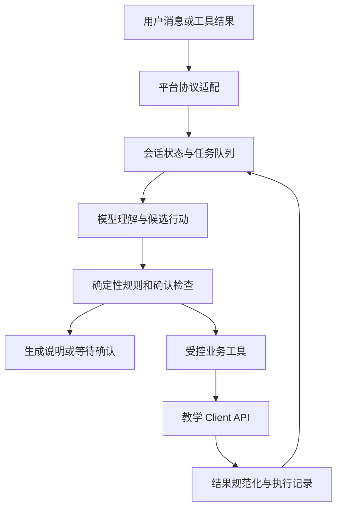
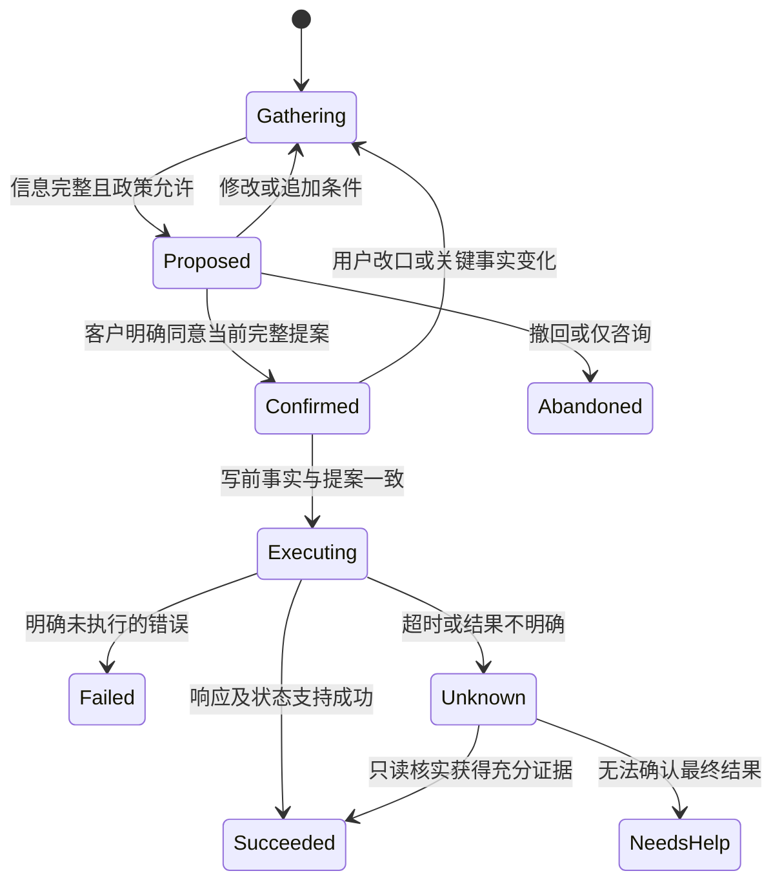

# Retail-Agent 项目实施计划

制定日期：2026-09-29。基线：`main`，`c37119df88759ca9434035166184cef80ea709c3`。

本文是待实施计划。现有接入事实、已完成分析和未来工作分别标明；本文不代表业务功能已经实现或获得远程评测授权。

## 1. 项目判断与实施目标

项目可以进入实施阶段。代码、教学接口、业务材料和公开案例已足够支撑架构设计与离线开发。现状是一个通过 t1 的客户身份查询模板，距离完整零售客服 Agent，主要缺口是多轮任务管理、确认控制、订单规则、业务工具、模型适配和完整对话测试。

建议采用“模型理解自然语言与组织回复，确定性代码校验规则和控制执行”的方案。先形成一个从身份验证、读取订单、提出变更、等待确认到写入并核实结果的完整流程，再扩展其他业务。仅堆叠工具或把全部政策放进提示词，无法可靠处理客户改口、订单状态变化及一次性操作。

目标能力：

- 在同一会话中验证并服务一个客户，支持该客户多个订单和多个请求。
- 查询订单、商品规格、库存、价格、支付与履约事实，并解释支持范围。
- 按政策更新默认地址、订单地址、支付方式，办理取消、待处理商品修改、退货和换货。
- 在执行前获得与具体变更一致的确认；用户改口、报价变化或状态变化后使旧确认失效。
- 对不支持、越权、不可确认或结果不确定的请求给出真实说明，按需要转人工。
- 所有业务结论由 API 事实和规则得出，不按公开案例 ID、客户固定数据或答案表分支。

本计划覆盖完整业务能力的开发准备，不改变当前 `t1` 绑定，也不授权运行全部公开案例。项目没有建设独立网站、数据库、支付系统或生产客服部署的需求；这些不纳入本轮实施。

配套文档：

- [业务规则与证据台账](E:/Retail-Agent/docs/POLICY-REGISTER.md)：规则、生效依据、过时方案和待核实边界。
- [案例覆盖与验收矩阵](E:/Retail-Agent/docs/CASE-COVERAGE.md)：134 项公开案例的分类、代表案例和测试批次。

## 2. 已核实的基线

| 方面 | 当前事实 | 实施含义 |
|---|---|---|
| 项目位置 | `E:\Retail-Agent` | 代码、开发测试及派生项目文档放在这里 |
| 原始材料 | `E:\enterprise-ai-materials`；解压资料在 `extracted\materials` | 保持仓库外；运行时不读取本机这个路径 |
| 凭证 | `E:\Enterprise-AI.json` | 保持仓库外；本计划不读取内容，不复制到代码或文档 |
| 绑定 | `5147314e-f2da-4bac-924a-e2ad95e647e4` | 不替换、不重新绑定 |
| 仓库/分支 | `1471436961/retail-agent` / `main` | 不擅自改评测分支 |
| 场景/语言/任务 | `retail_plus` / Python / `t1`；用户给定 `case_ids: null` | 不把 null 理解为运行全部 134 个案例 |
| 入口 | `agent/agent.py`、`agent/tools.py`、`agent/agent.json` | 保留平台工厂及工具发现方式 |
| 已实现功能 | 一个 `lookup_customer` 工具，先邮箱搜索再读档案 | 使用了 14 个 REST 操作中的 2 个，尚无业务写能力 |
| 状态管理 | `turn`、`pending_call_id`、`customer_id`；初始化忽略历史 | 需要扩展身份、任务、提案、确认、执行结果和历史恢复 |
| 模型 | 现有模板不调用模型，也未捕获运行时 context | 先核实网关契约，再接薄适配层 |
| 本地测试 | 本次使用可用的 Python 3.12 解释器重跑：6/6 通过 | 只覆盖基础查询、纯函数和适配器，不代表完整轮次或业务通过 |
| 既有远程报告 | t1，`integration-check`，1/1 passed | 身份验证先于档案读取已通过；不是 p1/t2 业务成绩 |

既有报告：[GitHub Actions](https://github.com/1471436961/retail-agent/actions/runs/36437403776)、[Agentist 结果](https://agentist.org/lab/enterprise-ai?run=4df4483b-8eb7-4614-b0fd-4e79f069080d)。本次只是核对已下载报告，没有提交新评测。报告记录上述 commit；平台同时以上传代码快照哈希标识实际提交内容，不将其表述为平台独立拉取并验证了仓库提交。

分析材料包括：工程源码和测试、框架契约、教学 OpenAPI、134 项公开案例、身份 intake、历史案例、14 封邮件、5 份会议记录、Slack 导出、嵌套接口/系统导出、5 张流程图和 25 页培训 PDF。截图已建立 60 张的索引并重点核对业务帮助页；截图索引不等于所有像素均已逐字核验。历史案例是政策证据，不等同于公开评测 ID。

## 3. 规则与接口的使用原则

### 3.1 区分三类权威

1. **实际调用方式**：以本仓库 `materials/client_api/openapi.yaml`、框架契约、`materials/CLASSROOM.md` 为准。课堂说明明确覆盖上游不适用的运行方式。
2. **业务允许做什么**：按生效范围、正式状态和日期裁决读取业务证据。正式决定优于提案；只在同一业务范围内比较版本，不能简单选文件名含 final 或日期最大的文件。
3. **需要覆盖哪些需求**：公开案例提供客户需求及预期，必须连同“业务要求”阅读；它们不是可硬编码的答案，也不是后台规则的替代品。

参考手册材料只提供了部分信息，不能声称掌握未提供的完整手册。遇到现有证据无法消除的冲突，写入问题台账，先完成不依赖该争议的工作，在相关写操作启用前解决。

### 3.2 必须固化为代码与测试的规则

| 规则组 | 实施要求 |
|---|---|
| 身份与归属 | 邮箱或完整姓名＋邮编独立搜索；客户 ID、订单号、档案内读出的邮箱不能替代验证。验证后限定本客户，订单详情仍核对 owner |
| 查询与授权 | 询问、讨论方案、表达偏好不是写入许可；只读查找不要求业务变更确认 |
| 完整确认 | 各类记录变更均须说明目标记录和相关变更；订单、商品、金额、支付方式在相关时必须明确。地址修正后重新完整复述 |
| 单次商品修改 | 待处理订单整单收齐商品替换，一次提交；确认完整清单、询问是否还有其他修改，并等待回复。提交后进入 `pending (items modified)`，不能继续改地址、支付或取消 |
| 取消 | 仅接受 `no longer needed`、`ordered by mistake` 及语义明确的自然表达；价格投诉等不能强行归类。先获得原因，再复述订单、金额、退款去向并确认 |
| 退款 | 取消、退货、换货、商品修改和支付切换分别建规则。不得复用一个无差别的“退款到任意卡”函数 |
| 商品 | 区分 product 与 item；同产品可用规格替换；未要求修改的属性保持。保留重复商品的次数，不能用集合悄悄去重 |
| 金额 | 基于订单成交价、当前目标规格价和真实支付记录；精确到分。退款记录与支付记录分开，不把订单取消等同于退款到账 |
| 状态 | 每个新操作和写前检查真实状态；用户说已收到，不替代后台 delivered。保留原始状态枚举 |
| 能力边界 | 不改数量、不拆单、不改邮箱、不添加支付方式、不下新订单、不恢复已取消订单；网页具有某功能不代表 Agent 获得其 API 权限 |
| 不确定结果 | 所有写操作及转人工禁止自动重试；查询核实不能证明结果时，保留不确定状态并停止依赖动作 |
| 转人工 | 使用可信 `client_api.context.conversation_id`；受理后结束业务工具流；按适用要求输出规定提示 |

### 3.3 订单状态与写操作基线

| API 状态 | 允许的订单写操作 | 主要处理方式 |
|---|---|---|
| `pending` | 地址、支付、取消、同产品规格修改；仍需各自前提 | 写前检查；若履约事实与未发货假设冲突，先停止该写入并核实 |
| `processed` | 无 | 说明当前限制；送达后可按政策退换，客户坚持时按流程转人工 |
| `delivered` | 开启退货或换货 | 同单两类请求冲突时先明确最终选择，不先执行其中一半 |
| `pending (items modified)` | 无进一步订单修改/取消 | 保留本次已完成结果，拒绝第二次追加或伪装为普通 pending |
| `cancelled` | 无 | 可解释已记录结果，不恢复、不再次取消 |
| `return requested` | 不追加新的退换申请 | 查询并说明已提交范围，不声称已经退款到账 |
| `exchange requested` | 不追加新的退换申请 | 查询并说明已提交范围、差价及支付方式 |

默认地址属于客户档案，不等于订单地址。修改其一不能顺带更改另一项；客户同时要求两者时分别列入提案和执行结果。

## 4. 目标架构

### 4.1 执行路径



模型输出只是候选行动。实际发出工具调用前，应用层审核身份、订单归属、动作类型、完整参数和确认快照。工具层再根据自身可重放的会话记录和最新后端事实核对权限、状态和参数。

工具层与应用层不能依赖未记录的共享全局内存。模型参数中的 `confirmed: true` 不构成用户确认。工具重放能证明已记录调用的可重复执行行为，不能独立证明用户说过什么；这项证据由应用层保留真实消息关联，并以对话轨迹测试验证。

### 4.2 模块职责与预期目录

以下目录是实施方向，不要求先创建空壳文件。随着阶段交付增加实际需要的模块，控制总文件数。

```text
E:\Retail-Agent\agent\
  agent.py                          工厂入口、获取并保留平台 context
  tools.py                          工具发现入口
  agent.json                        现有协议、语言和领域声明
  support_agent\
    application.py                  轮次控制与模型建议审核
    state.py                        JSON 会话状态及恢复
    protocol.py                     内部消息、行动、结果类型
    adapters\
      model_gateway.py              已核实的 Python 网关适配
      client_api.py                 传输、路径编码、响应与错误规范化
      customer_api.py                身份与客户档案
      catalog_api.py                 产品与具体规格
      order_api.py                   订单读写
      business_tools.py              工具声明及可重放工具状态
    domain\
      identity.py                    验证与归属
      orders.py                      状态及一次性操作规则
      catalog.py                     规格筛选、数量与候选排序
      money.py                       精确金额和差价
      policies.py                    支付、退款、取消及能力边界
      proposals.py                   提案、确认版本及失效规则
    workflows\
      inquiry.py                     只读与解释
      pending_order.py               待处理订单
      returns_exchanges.py           已送达退换
      handoff.py                     人工转接
    policies\                       精简的生效规则与规则编号
    prompts\                        模型行为与结构化决策说明
E:\Retail-Agent\tests\              纯规则、适配器、状态化对话和重放测试
E:\Retail-Agent\docs\               规则、追踪矩阵、决策记录及验收报告
```

继续使用标准库优先的轻量实现；本地 `tau2` 不可用时，将核心轮次决策与平台类型分开。不要引入大型 Agent 框架、向量数据库或自建持久化服务作为默认前提。原始材料先整理成精简、可追溯规则，运行时无需对整包邮件和截图做检索。

### 4.3 会话状态

| 状态项 | 内容与约束 |
|---|---|
| `schema_version` / `turn` | 允许明确升级状态结构；调用 ID 用确定性会话序号生成 |
| `identity` | 验证状态、已验证 customer_id、验证方式和来源消息；未验证的用户声明单独保存 |
| `history` | 规范化消息和关键事实；恢复时不重新发出已执行写操作；摘要保留所有未完成提案与确认关系 |
| `tasks` | 每个客户请求的目标、订单、约束、依赖和进度；不把所有订单合成一个状态 |
| `facts` | 后台返回的订单、商品及支付事实与获取序号；确认后、写前按需刷新 |
| `proposals` | 动作、目标、完整商品多重列表、地址、支付/退款方式、金额、版本及关联消息 |
| `pending_calls` | call_id → 动作、任务、目标、预期结果；支持缺失、重复、乱序结果处理 |
| `operations` | 未执行、执行中、成功、明确失败、结果不确定；保存已消费工具结果和真实回执 |
| `handoff` | 未请求、请求中、已受理、结果不确定；已受理后禁止继续业务调用 |

state 只能包含 JSON 可序列化内容。金额内部用 Decimal 或整数分计算，state 保存规范化十进制字符串或整数分；不能把 SDK、网关对象或 Decimal 实例直接塞入 state。网关对象保留在 Agent 实例中，客户状态不能放模块全局变量。

### 4.4 确认与执行状态机



提案版本必须覆盖语义内容，不能只标记“该订单已经确认”。客户只确认其中一项时，仅该项可获授权；“可以，不过把蓝色改为黑色”属于新提案。明确确认仍有效且事实未变时不反复索取同一确认。

同单地址、支付和商品修改的组合需要先确定客户最终意图、分别说明影响，通常先完成地址/支付再执行会锁定订单的商品修改。若同时存在取消请求，先澄清最终选择；不能用固定排序替代客户意图。跨单操作分别记录结果，不假设存在跨订单事务，也不自动回滚已经成功的业务操作。

## 5. API 覆盖与工具设计

完整目录来自 [教学 OpenAPI](E:/Retail-Agent/materials/client_api/openapi.yaml)。共 14 个操作：6 个只读（包括 POST search）、8 个更改状态。下表按 HTTP 操作计数，Agent 工具可组合多个操作。

| # | 操作 | 用途 | 首次交付 |
|---|---|---|---|
| 1 | `POST /v1/customers/search` | 邮箱或完整姓名＋邮编验证 | M2 |
| 2 | `GET /v1/customers/{customer_id}` | 已验证客户档案、支付方式、订单引用 | M2 |
| 3 | `PUT /v1/customers/{customer_id}/default-shipping-address` | 默认地址完整更新 | M4 |
| 4 | `GET /v1/catalog/products` | 获得产品目录，按信息权限和业务相关性使用 | M2 |
| 5 | `GET /v1/catalog/products/{product_id}` | 同一产品规格目录 | M2 |
| 6 | `GET /v1/catalog/items/{item_id}` | 精确规格、库存、价格 | M2 |
| 7 | `GET /v1/orders/{order_id}` | 归属、状态、成交商品、交易与履约 | M2 |
| 8 | `PUT /v1/orders/{order_id}/shipping-address` | 订单地址完整更新 | M4 |
| 9 | `PUT /v1/orders/{order_id}/payment-method` | 更换一个已有支付方式 | M4 |
| 10 | `POST /v1/orders/{order_id}/cancellations` | 已确认原因的取消 | M4 |
| 11 | `POST /v1/orders/{order_id}/item-modifications` | 完整规格替换列表与差价方式 | M5 |
| 12 | `POST /v1/orders/{order_id}/returns` | 完整 item_ids 与退款方式 | M5 |
| 13 | `POST /v1/orders/{order_id}/exchanges` | 完整替换列表与差价方式 | M5 |
| 14 | `POST /v1/conversations/{conversation_id}/transfers` | 问题摘要与受控转接 | M4 |

实现要求：

- 工具只公开已知业务动作，禁止开放任意 URL、HTTP 方法或任意 JSON 透传工具。
- 地址按教学 `Address` 结构发送；不得把材料中的姓名、备注等未经支持字段加入请求。`address_line_2` 的空串、缺失和 null 依契约处理。
- 替换使用 `existing_item_id`、`replacement_item_id`；数量和重复行的映射须测试，不能凭空增加后端 line_id 参数。
- 所有路径标识符 URL 编码，保留 `#W...` 原始值；订单猜测需经自有订单列表验证，不任意纠正或试探他人订单。
- 响应先检查状态码和结构，再形成领域结果。使用实际 `customer_id`、`payments`、`return_request`、`exchange` 等教学字段，不能直接套用历史导出的字段名。
- 区分 400、404、409、422、413、502 和传输异常；业务拒绝要回到澄清/解释，不能统一伪装成“找不到”。
- 读取允许有界重试；所有写入和转接均禁止自动重试，包括看似幂等的 PUT。
- 成功写入具有强一致性，可读取核实；未知结果只能查已有端点，不编造任务轮询或幂等接口。
- 分页为 none，不追加自定义分页参数；请求/响应超限不通过拆分一次性业务写操作绕过。
- 付款、退款、库存变动由业务端点处理；不在 Agent 自建支付账本或向不存在的退款接口写入。

## 6. 模型接入与运行约束

### 6.1 前置验证

已知 Python 工厂需使用 `get_agent_context()`，并保留 `model_gateway`；允许能力含 `action_interface`、`resources`、`runtime_config`。待核实 `generate()` 的完整参数与返回结构、工具 schema 获取方式、错误及用量返回。不能从 TypeScript 示例推导 Python SDK 的接口。

本地 manifest 的 `allowed_agent_models` 只有 `openai/enterprise-haiku`，固定 `max_tokens: 1024`；预算段另列多种模型和 `0.32` credits。两者不一致，不能据此自行选择其他模型或认定已获费用授权。以届时实际允许列表和明确费用授权为门槛。

固定参数按平台约定省略并由网关补充；`one_of` 参数明确选择合法值。建立 fake gateway 验证接口适配和异常流程，再安排一次经授权的最小真实调用。t1 没有执行到某条模型路径时，其通过不能证明该路径兼容。

### 6.2 运行边界

- 仅 `agent/` 会被上传：最多 128 个文件，单文件 256 KiB，总计 2 MiB。
- 远程不安装依赖、不运行构建脚本；不上传虚拟环境、原始 ZIP、测试数据或整个业务材料库。
- 运行时不得依赖 `E:` 盘、repo 根目录文档或开发缓存。必要的规则摘要和提示词随 `agent/` 打包。
- 使用平台注入 Client API 与模型网关，不带用户凭证、外部模型 SDK 或自行联网请求。
- `AssistantMessage` 只能包含文本或工具调用之一；禁止在同条消息里询问确认并执行写入。
- 不以当前墙上时间、随机数或会话外状态决定工具业务行为。相同历史调用在新工具实例和新后端上必须可以确定性重放。

### 6.3 成本与性能

以实测决定优化，不编造单次费用或轮次 SLA。记录可获得的模型调用次数、token/credits、工具调用数和总轮次，不记录凭证。优先减少重复身份验证、重复读同一目录和把整段原始材料送入模型。

设定有界模型循环与错误修复次数；非法动作或结构解析失败只允许受控修复，绝不因此跳过确认。先保证规则正确，再评估精简上下文、目录缓存和独立读取并行；写操作保持明确串行与依赖关系。

## 7. 分阶段实施清单

状态：下列任务均为**待实施**，已有基线测试和本次规划分析不勾选成业务开发完成。工作量使用小/中/大相对等级，不承诺未经测量的日历工期；M0/M1 完成后再依据真实阻塞和开发速度排期。

依赖：`M0 → M1 → M2 → M3 → M4 → M5 → M6 → M7`。M0 的接口调查与规则整理可并行；M1 的领域测试不必等待付费运行时探测，但真实模型接入必须等待其契约确认。

### M0：冻结规则与契约基线（优先级 P0，工作量中）

- [ ] M0.1 将本计划的规则初稿扩为逐条可引用台账：规则编号、范围、生效状态、日期、来源位置、被替代版本、正/反测试。
- [ ] M0.2 对 134 项案例逐条补齐“客户需求＋业务要求 → 原子能力 → 规则 → API → 测试”的追踪；保留改口、条件和追加要求。
- [ ] M0.3 建立教学与历史字段映射，记录响应变体和数据规范化方式；提取 14 个端点的输入、输出、错误与重复调用约束。
- [ ] M0.4 核实 Python 网关、操作目录和消息协议，记录受支持的最小示例；明确哪些仍须真实环境验证。
- [ ] M0.5 解决第 9 节 U1–U6 中与即将开发功能相关的条目；不能解决的注明阻塞范围和证据需求。

**产物**：更新的规则/案例台账、接口映射、运行时契约说明、待决问题清单。

**验收**：每项关键禁止行为有来源和负例；134 个 ID 无遗漏但不声称全部已测试；历史/教学字段不混用；模型未知项有明确验证方式。

### M1：协议、状态与离线测试底座（P0，中）

- [ ] M1.1 保持入口兼容，抽取不依赖 tau2 的内部消息/动作类型与轮次决策。
- [ ] M1.2 实现可序列化状态、会话隔离、pending_calls 和历史恢复，明确恢复时不重复写。
- [ ] M1.3 建立状态化 fake API、脚本式 fake gateway、合成客户/订单/商品数据；保留现有 6 个回归测试。
- [ ] M1.4 实现公共响应与错误分类、未知工具拒绝、schema 校验和有界循环。
- [ ] M1.5 加入工具历史重放及打包隔离检查；验证从干净 `agent/` 导入，不依赖 tests/materials。

**验收**：state 每轮 JSON 往返不丢信息；会话互不污染；重复、缺失、乱序工具结果不误报成功；模型生成写动作但缺乏许可时实际写 API 次数为 0。

### M2：身份与完整只读服务（P0，中）

- [ ] M2.1 完成邮箱、姓名＋邮编两种验证；避免只靠客户 ID，验证成功后保留本会话身份。
- [ ] M2.2 支持读取自有订单、筛选状态、澄清错误/不完整订单描述并核对 owner。
- [ ] M2.3 接产品与 item 查询，区分规格、库存、当前价格、成交价格和履约分组。
- [ ] M2.4 实现查询类意图及未知信息回复，明确身份失败时不泄露账户/订单信息。
- [ ] M2.5 在网关契约明确后接入 model adapter；用 fake 返回覆盖合法、非法和失败输出。

**验收**：6 个只读端点契约测试通过；ID 121/126 对应越权/失败原则得到合成对话覆盖；既有 t1 行为保持兼容。真实 t1 回归只在届时获授权后运行。

### M3：通用提案、确认及规则引擎（P0，大）

- [ ] M3.1 建立领域金额、规格、支付与状态规则；返回可解释的允许/拒绝/需补充信息结果。
- [ ] M3.2 实现提案版本，绑定完整目标、参数、金额及确认消息；不接受模型自报 confirmed。
- [ ] M3.3 实现局部确认、追加、撤回、条件分支、改变支付方式及报价变化后的失效。
- [ ] M3.4 建立同单动作依赖与冲突判断；独立订单分开推进。
- [ ] M3.5 写前重读关键事实，写后规范化回执；超时进入 Unknown，不自动重试。

**验收**：确认状态矩阵通过；未确认、旧确认、局部确认不匹配的目标均零写入；查询结果变化后不得执行旧提案；一次未知写结果最多一笔写调用。

### M4：地址、支付、取消与人工转接（P1，大）

- [ ] M4.1 默认地址和订单地址分别实施，完整复述必填字段，修正后重新确认；分别核实结果。
- [ ] M4.2 更换支付方式：已有且不同的一种方式，礼品卡覆盖整单；遵守后端先扣新款再退旧款语义。
- [ ] M4.3 取消：原因语义归类、允许状态、订单/金额/退款去向复述，按实际交易明细核实结果。
- [ ] M4.4 转人工：摘要说明已验证事实、诉求、已完成操作与阻塞原因；可信 conversation_id；受理后终止业务调用。
- [ ] M4.5 各流程覆盖正常、政策拒绝、用户改口、后台 409/422、写超时、返回缺字段。

**验收**：5 个新增写端点均有正/负测试；地址不串记录；取消退款不按净额合并历史支付；转接提示只在真实受理语义下表述，不凭空宣称已完成。

### M5：商品修改、退货与换货（P1，大）

- [ ] M5.1 实现商品候选筛选：硬约束→库存→保留属性→偏好/回退→排序；并列候选且缺少决策依据时询问。
- [ ] M5.2 待处理商品修改收齐完整列表，计算差价，说明单次限制，完成最后补充询问并等待后一次提交。
- [ ] M5.3 退货收齐完整 item 列表，以成交价计算范围，限制退款目的地；不把提交请求当到账。
- [ ] M5.4 换货核对同产品规格、完整列表和差价方式，提交后禁止追加或改变已选方式。
- [ ] M5.5 覆盖同款多件/重复 item、同单退换冲突、零差价、礼品卡余额不足、取消一部分意图。

**验收**：全部 14 端点已纳入契约测试；相关业务流程各有成功、拒绝、改口、结果不确定四类测试；ID 120/125 的后续追加原则、105/119 的重复商品原则覆盖。

### M6：组合对话、故障与成本回归（P1，大）

- [ ] M6.1 根据完整追踪矩阵构建本地对话批次，检查实际调用轨迹和最终状态，不只检查回复关键词。
- [ ] M6.2 重点回归地址＋商品、默认地址＋订单地址、同单退换、多订单混合请求和跨单金额汇总。
- [ ] M6.3 新工具实例＋相同初始后端重放完整工具轨迹；覆盖恢复、重复回执和中断后的未知结果。
- [ ] M6.4 测试畸形响应、超限、模型非法参数、工具内容中的无关指令；业务数据不能授予新权限。
- [ ] M6.5 检查包大小、文件数、路径依赖、日志与密钥；在可获得计量信息时建立实测成本基线。
- [ ] M6.6 按缺陷类型修复：规则理解、工具参数、确认流程、对话遗漏、运行时兼容分别记录根因。

**验收**：134/134 有需求追踪，每项原子要求有测试或明确待真实环境验证的记录；关键禁止行为零违规；本地通过不能标注为真实 134/134 通过。

### M7：授权范围内的远程验证与交付（P1，中；等待外部授权）

- [ ] M7.1 展示最终变更文件、目标仓库/分支、任务与案例范围；检查暂存内容不含凭证、ZIP 或用户原有无关修改。
- [ ] M7.2 确认模型配置、费用上限和运行范围，获得明确 commit/push 授权；使用具体文件暂存，不默认 `git add .`。
- [ ] M7.3 先验证入口及当前 t1；需要 p1/t2 时明确申请对应授权，不擅自修改绑定。
- [ ] M7.4 有新提交推送后等待同一个 GitHub 工作流/Job，不再另行提交一份 evaluate。
- [ ] M7.5 保存任务、commit、上传快照、模型、案例、实际通过/失败、错误类别和网页链接；未评分与业务失败分开报告。
- [ ] M7.6 仅对有根因和修复的失败重新验证；401/403/503 或工作流失败按用户要求脱敏报告并停止，不循环重试。

**验收**：同一运行结果可追溯；已获授权范围内的结果与未运行范围明确区分；所有剩余失败、限制及已知缺陷披露。正式通过目标依据届时选定案例和课程要求确定，不自行编造评分阈值。

## 8. 测试与质量门槛

| 测试层 | 关注点 | 必要断言 |
|---|---|---|
| 领域纯函数 | 状态×动作、身份、owner、规格、金额、支付目的地 | 边界与反例；不能把拒绝简单改成成功 |
| API 适配 | 14 操作、路径、正文、null、错误、响应变体 | 精确方法/路径/参数；写操作不自动重试 |
| 轮次协议 | 用户→提案→确认→工具→回复 | 文本与工具互斥；结果按 ID 关联 |
| 多轮状态 | 改口、撤回、部分确认、历史恢复、多订单 | 最终执行参数等于最新有效确认 |
| 工具重放 | 新实例/相同起始后端重放相同记录 | 最终状态和副作用次数一致 |
| 模型适配 | 允许模型、约束、非法输出、错误 | 未知动作不执行；固定参数与 one_of 遵守契约 |
| 打包 | 上传目录、体积、依赖、外部路径 | 干净 agent 包可加载；不依赖材料绝对路径 |
| 真实运行 | SDK/后端部署差异、完整业务对话 | 实际报告与范围；本地 fake 不能替代此证据 |

关键门槛：

1. 越权、未确认、确认失效、一次性操作后的追加、用户撤回后执行：**实际写调用为 0**。
2. 超时或不确定写结果：**原动作写调用不超过 1 次**，不能宣称未经证实的成功或失败。
3. 同一任务准确金额、正确商品次数、正确地址记录、正确支付/退款目的地共同满足；只回复正确不算完成。
4. 转人工受理后业务 API 调用为 0；返回失败或未知不能说“已经转接成功”。
5. 对敏感详情，核验前不得输出；本地测试应检查输出和调用轨迹两方面。
6. 只在有来源要求时逐字匹配，例如适用人工转接提示；普通业务回复验证事实与语义，避免测试锁死自然语言。

现有本地命令在 Python 路径可用的用户终端中为 `python -m unittest discover -s tests -v`。本次核查用的是可用的完整 Python 3.12 路径。实施开始时先检查当前解释器，不能把 sandbox 下 trampoline 的 permission denied 误报成业务测试失败。

## 9. 待核实事项与风险处理

| 编号 | 已知问题/风险 | 处理方法 | 阻塞范围 |
|---|---|---|---|
| U1 | Python gateway 签名、消息/工具 schema 和用量字段未完整提供 | 取得支持文档/运行时示例；fake 验证；经费用授权做最小探测 | 真模型适配；不阻塞领域测试 |
| U2 | manifest 允许模型与预算模型列表不同 | 以实际 available_models 与约束核实；确认选择及费用 | 真实模型调用和付费评测 |
| U3 | 教学字段与历史字段不同；已有报告 gift balance 为数字字符串 | 建立明确读适配；只容忍已证实变体；输出严格符合教学 API | 金额/支付与真实响应兼容 |
| U4 | 历史产品信息权限限于客户订单相关商品，公开需求包含目录计数/选购查询 | 逐例核对业务相关性与范围；API 存在不等于匿名导购授权；残余冲突向用户呈现证据后定规则 | 超出已验证客户相关范围的目录功能 |
| U5 | 重复 item ID 表达数量/实例时，教学请求只有 item_id 对 | 保留列表次数；用文档和受支持数据核实重复项语义；不得杜撰 line_id 或去重 | 多件同款替换/退换 |
| U6 | 历史 guard 使用 shipped，教学 Order 无该字面字段；money 舍入未定义半分规则 | 使用 status/fulfillments 可见事实；冲突时不写。优先整数分差值，确需半分算法时取得依据 | 异常履约组合及未定义金额计算 |
| R1 | 旧提案被客户新请求覆盖，却仍被执行 | 确认版本绑定完整语义，改口使相关版本失效 | M3 放行门槛 |
| R2 | 一次性商品修改过早锁单 | 收齐清单和所有同单前置修改；最后提交商品替换 | M5 放行门槛 |
| R3 | 非幂等写在 timeout 后重复执行 | Unknown 状态、仅查询核实、没有充分证据则停止依赖动作 | 所有写操作 |
| R4 | 将训练稿、旧裁决或网站功能当现行权限 | 生效规则台账、来源回溯与负例测试 | 所有规则 |
| R5 | 代码依赖仓库外资料或未安装依赖 | 干净 agent 包检查，标准库优先 | 远程运行 |
| R6 | 只看 Actions 绿色而误报业务通过 | 读取同一 job 的结构化 report，分开运行状态与业务 verdict | 交付验收 |

这些问题不要求现在一次性询问用户。先完成可独立进行的规则、接口与离线工作；只有真实登录、费用、提交推送、范围变更或证据无法消除的业务选择需要用户参与时，提供具体结果后再询问。

## 10. 开发协作与交付方式

每个实施批次保持可审查范围：规则及失败测试 → 最小实现 → 适配器/对话测试 → 本地回归 → 变更说明。不能为提高成绩而削弱禁止行为，不能按 case_id 特判，也不能修改评测脚本或测试范围来隐藏失败。

M1 后可以并行推进领域规则/测试、API 适配器、业务工作流三个方向。`application.py`、`state.py`、`protocol.py` 和 `business_tools.py` 需有统一维护者与接口约定，避免不同人同时建立不兼容的状态和调用约定。

提交粒度建议对应上述阶段或独立可验收流程。是否创建开发分支在进入编码时依据当前工作区和协作需要决定；当前规划不创建分支、不修改绑定。任何 commit/push 前继续遵守用户的明确确认要求。

每阶段交付说明至少包括：已完成任务编号、变更文件、通过的测试、仍未解决的问题、下一阶段入口条件。真实评测记录另外保存，不能把“本地已覆盖”替换为“平台已通过”。

文档与源代码可以进 Git；原始 ZIP、解压完整材料、权限 JSON 和运行凭证保持仓库外。运行时只带经过整理的必要规则，不带案例答案和固定客户数据。文档中的本机路径用于追溯，不成为业务运行依赖。

## 11. 建议开始的第一批工作

进入编码后的第一批工作锁定 **M0 和 M1**：完成规则/案例的原子要求追踪、确认 Python 网关契约、建立协议隔离与状态化测试底座，并保留 t1 行为。随后以“验证客户 → 读自有订单 → 确认订单地址 → 更新并核实”作为第一个完整业务流程，再扩展支付、取消和复杂商品操作。

该顺序把最可能返工的接口和确认机制放在前面，同时较早获得能端到端验证的业务能力。本计划制定完成后，仍需用户另行指示开始实施；不会因生成计划而自动开始业务编码、提交或评测。
